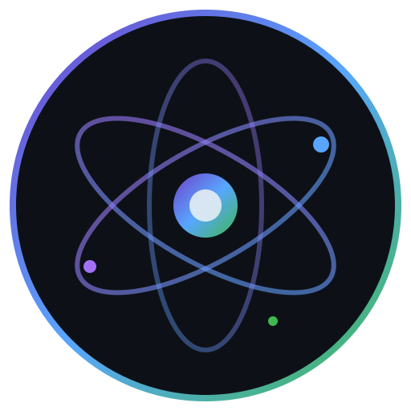

# OrbitFrame

A futuristic screen capture and sharing toolkit — an open-source alternative to ShareX built with Electron.



## Features

### Screen Capture
- **Fullscreen** — Capture the entire screen instantly
- **Region** — Click and drag to select any area
- **Window** — Capture a specific application window
- **Scrolling** — Capture long pages beyond the viewport
- **Last Region** — Re-capture the previous region selection

### Recording
- **GIF Recording** — Record animated GIFs with configurable FPS
- **Video Recording** — Screen recording in WebM/MP4 with system audio + microphone support
- **Countdown Timer** — Optional countdown before recording starts

### Annotation & Editor
- Draw shapes: rectangles, circles, lines, arrows
- Freehand pencil drawing
- Text overlay
- Highlight regions
- Blur/pixelate sensitive areas
- Customizable colors and stroke widths
- Undo/Redo support
- Keyboard shortcuts for every tool

### Upload System
- **Local** — Save to disk with optional built-in HTTP file server
- **Imgur** — Upload anonymously or with your account
- **Custom API** — Configure any REST endpoint (URL, method, headers, field name, response path)
- Auto-generated shareable links copied to clipboard

### Workflow Automation
After each capture, OrbitFrame can automatically:
- Save to file
- Copy to clipboard
- Upload to configured service
- Open in the built-in editor
- Show a preview with action buttons
- Display a system notification

### Hotkeys
Fully customizable keyboard shortcuts for every action:

| Action             | Default Shortcut         |
|--------------------|--------------------------|
| Fullscreen         | `PrintScreen`            |
| Region             | `Ctrl+Shift+A`           |
| Window             | `Alt+PrintScreen`        |
| Scrolling          | `Ctrl+Alt+PrintScreen`   |
| Record GIF         | `Ctrl+Shift+G`           |
| Record Video       | `Ctrl+Shift+V`           |
| Clipboard Capture  | `Ctrl+Shift+C`           |
| OCR Extract        | `Ctrl+Shift+O`           |
| Last Region        | `Ctrl+Shift+L`           |

### Bonus Features
- **OCR** — Extract text from any screen region using Tesseract.js
- **Dark/Light Theme** — Orbital (dark) and Nova (light) themes
- **Persistent Settings** — All preferences saved across sessions

## Project Structure

```
orbframe/
├── assets/                  # Icons and images
│   ├── icon.svg             # App icon (orbital design)
│   └── tray-icon.svg        # System tray icon
├── scripts/
│   └── generate-icons.js    # PNG icon placeholder generator
├── src/
│   ├── main/
│   │   └── main.js          # Electron main process (window, tray, IPC, hotkeys)
│   ├── capture/
│   │   ├── capture.js       # Fullscreen, region, window, scrolling capture
│   │   └── ocr.js           # Tesseract.js OCR text extraction
│   ├── upload/
│   │   └── upload.js        # Imgur, custom API, and local upload handlers
│   ├── workflow/
│   │   └── workflow.js      # After-capture automation pipeline
│   ├── utils/
│   │   ├── config.js        # Persistent settings via electron-store
│   │   └── helpers.js       # File naming, clipboard, utilities
│   └── ui/
│       ├── index.html        # Main application window
│       ├── renderer.js       # UI logic, navigation, editor, history
│       ├── editor.html       # Standalone annotation editor window
│       ├── region-selector.html    # Region selection overlay
│       ├── recording-selector.html # Recording region + controls overlay
│       └── styles/
│           └── theme.css     # Complete dark/light orbital theme
├── package.json
├── .gitignore
└── README.md
```

## Setup

### Prerequisites
- [Node.js](https://nodejs.org/) v18+
- npm or yarn

### Install

```bash
# Clone the repository
git clone https://github.com/your-username/orbframe.git
cd orbframe

# Install dependencies
npm install

# Generate placeholder icons
node scripts/generate-icons.js

# Start the application
npm start
```

### Build for Distribution

```bash
# Windows
npm run build:win

# macOS
npm run build:mac

# Linux
npm run build:linux
```

Builds are output to the `dist/` directory.

## Configuration

All settings are stored persistently and accessible from the Settings page. Configuration is saved at:

- **Windows:** `%APPDATA%/orbframe-config.json`
- **macOS:** `~/Library/Application Support/orbframe-config.json`
- **Linux:** `~/.config/orbframe-config.json`

### Upload Setup

**Imgur:** Get a Client ID from [Imgur API](https://api.imgur.com/oauth2/addclient) and paste it in Settings → Upload → Imgur.

**Custom API:** Configure your endpoint URL, HTTP method, form field name, any extra headers, and the JSON path to extract the returned URL from the response.

## Tech Stack

- **Electron** — Cross-platform desktop framework
- **screenshot-desktop** — Native fullscreen capture
- **Jimp** — Image processing and cropping
- **Tesseract.js** — OCR text extraction
- **electron-store** — Persistent configuration
- **Canvas API** — Annotation and image editing
- **MediaRecorder API** — GIF and video recording

## License

MIT
